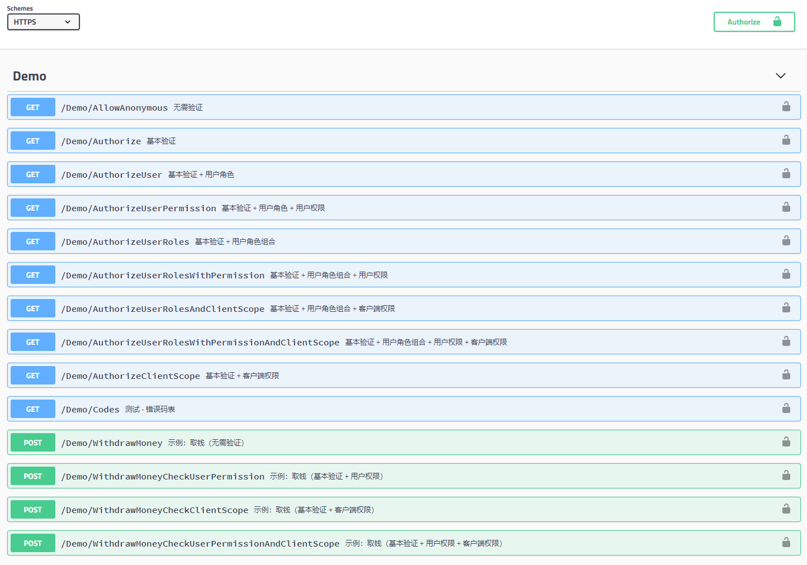

# 说明
微服务项目示例。

## 使用方法

```csharp
// Startup.cs
        // This method gets called by the runtime. Use this method to add services to the container.
        public void ConfigureServices(IServiceCollection services)
        {
            services.AddMvc().SetCompatibilityVersion(CompatibilityVersion.Version_2_2);

            services.AddMicroService(Configuration, options => {

                // 非必填，如果不设置就不会启用API鉴权
                options.IdentityServerUri = new Uri("IdentityServer4服务器地址");

                // 建议填写
                options.MicroServiceRedirectUrls = new List<string>()
                {
                    "https://{当前项目网址}/swagger/oauth2-redirect.html"
                };

                // 非必填
                //options.MicroServiceName = Assembly.GetExecutingAssembly().GetName().Name;
                //options.MicroServiceDisplayName = "MicroServiceDisplayName";
                //options.MicroServiceDescription = "MicroServiceDescription";
                //options.MicroServiceClientIDs = new List<string>() { "swagger" };
                //options.EnableApiVersioning = true;
                //options.EnableAuthorizationPolicy = true;
                //options.EnableCors = true;
                //options.EnableLocalization = true;
                //options.EnableResponseCaching = true;
                //options.EnableSwaggerGen = true;
                //options.EnableSwaggerUI = true;
                //options.EnableWebEncoders = true;
                //options.ImportToIdentityServer = true;
            });
        }


       // This method gets called by the runtime. Use this method to configure the HTTP request pipeline.
        public void Configure(IApplicationBuilder app, IHostingEnvironment env)
        {
            if (env.IsDevelopment())
            {
                app.UseDeveloperExceptionPage();
            }
            else
            {
                // The default HSTS value is 30 days. You may want to change this for production scenarios, see https://aka.ms/aspnetcore-hsts.
                app.UseHsts();
            }

            app.UseHttpsRedirection();

            app.UseMicroservice();

            app.UseMvc();
        }
```


#### 主要特性（自定义权限、多语言、多版本、入参/出参统一格式）



#### 多语言配置

    参照Resources/Controllers结构添加即可,名称必须与controller对应

#### API权限配置
```csharp
// GET api/values
        [HttpGet]
        // 验证client权限
        // 注意格式：以scope:{当前controller名称小写}.权限名称
        [Authorize(Policy = "scope:values.get")]
        // 验证用户权限
        // 注意格式：以permission:{当前controller名称小写}.权限名称
        [Authorize(Policy = "permission:values.get")]
        // 接口名称
         // 注意格式：controller名称+action名称
        [SwaggerOperation(OperationId = "ValuesGet")]
        public ActionResult<IEnumerable<string>> Get()
        {
            return new string[] { "value1", "value2" };
        }
```

#### appsettings.json配置
微服务模式，将API连接到IdentityServer4，配置appsettings.json文件
```json
{
  "Logging": {
    "LogLevel": {
      "Default": "Warning"
    }
  },
  "AllowedHosts": "*",
  "MicroService": {
    "IdentityServer": "IdentityServer4地址",
    "Name": "apiresource",
    "DisplayName": "微服务",
    "Description": "微服务测试项目",
    "ClientIDs": [ "swagger" ],
    "RedirectUrls": [ "https://当前项目地址/swagger/oauth2-redirect.html" ]
  }
}

#### 设计参考文档
  
  - https://docs.microsoft.com/zh-cn/azure/architecture/best-practices/api-design
  
  - https://github.com/Microsoft/api-guidelines/blob/master/Guidelines.md
  
  - http://restcookbook.com/
  
  - https://mathieu.fenniak.net/the-api-checklist/
  
  - https://docs.microsoft.com/zh-cn/azure/architecture/best-practices/api-implementation#more-information